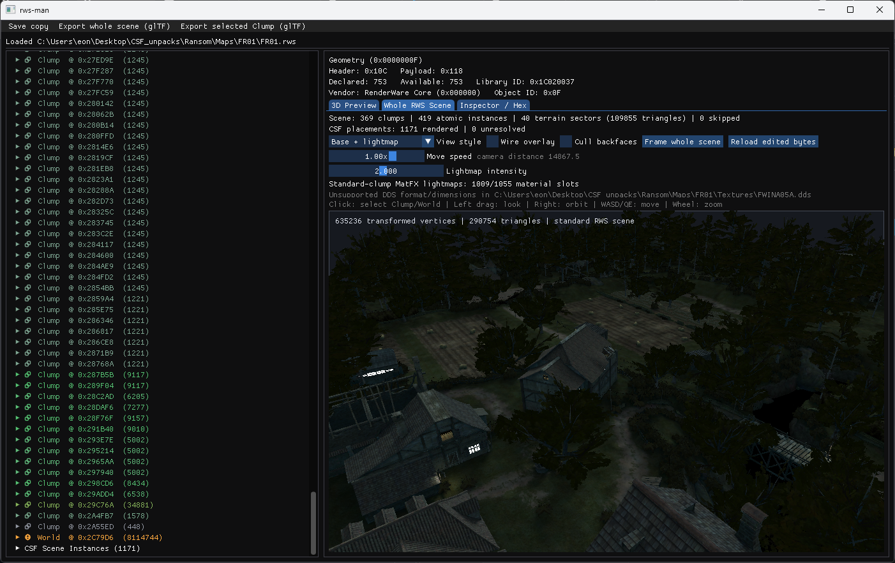

# csf-rws-tools

csf-rws-tools is a Windows inspection and reverse-engineering toolkit for
RenderWare Binary Stream (`.rws`) assets from *Commandos: Strike Force*. It
provides the `rws-man` graphical chunk browser and 3D scene preview, command-line
analysis tools, OBJ/glTF export, and a Blender add-on for inspecting and rebaking
the game's lightmaps.



The project is under active development. It understands many structures used by
*Commandos: Strike Force*, but it is not a general-purpose RenderWare editor and
does not claim complete format support. Unknown and truncated data is preserved so
that partially understood assets can still be inspected safely.

## Features

- Bounds-checked parsing of little-endian RenderWare chunk streams.
- Schema-aware inspection of Clumps, Geometry, Materials, Worlds, Frame Lists,
  Atomics, Skin, HAnim, User Data, Bin Mesh, MatFX, and other common plugins.
- Decoding of game-specific Pyro Studios metadata, Physics Body/Ragdoll data, and
  CSF scene-instance records.
- A Dear ImGui desktop application with a chunk tree, typed inspectors, hex
  editing, drag-and-drop loading, and save-to-copy behavior.
- Depth-tested OpenGL previews for individual geometry and assembled scenes,
  including DDS base textures, secondary-UV lightmaps, material diagnostics, and
  wireframe modes.
- Wavefront OBJ export for individual geometry.
- glTF 2.0 export for Clumps and assembled scenes, with two UV channels,
  materials, world sectors, CSF placements, and a texture/source manifest.
- Corpus-wide inventory and validation tools for reverse-engineering collections
  of `.rws` files.
- A Blender 4.0+ add-on for resolving exported materials, previewing lightmaps,
  preparing Cycles bakes, and staging game-ready DXT1/DXT3 DDS files.

No game files are included. You must supply assets from your own installation.
This project is not affiliated with Pyro Studios, Eidos Interactive, or the
RenderWare rights holders.

## Project layout

| Component | Purpose |
| --- | --- |
| `rws-man` | Desktop chunk inspector, hex editor, and 3D preview |
| `rws-info` | Inspect, validate, and export one `.rws` file |
| `rws-corpus` | Recursively inventory a directory of `.rws` files |
| `rws_core` | Parser, typed decoders, and export library used by all tools |
| `tools/blender/rws_lightmaps` | Blender material, bake, and DDS staging add-on |

Format notes live in [docs/rws-format.md](docs/rws-format.md), corpus results in
[docs/corpus-findings.md](docs/corpus-findings.md), and planned work in
[docs/roadmap.md](docs/roadmap.md).

## Requirements

- Windows x64.
- Visual Studio Build Tools 2026 (18.9.2) with the **Desktop development with
  C++** workload.
- CMake 3.24 or newer, available on `PATH`.
- Git, available on `PATH`.
- An OpenGL-capable graphics driver for the GUI.

CMake downloads the pinned GLFW 3.4 and Dear ImGui 1.91.9b sources the first time
the GUI build is configured. The core-only build does not require GLFW, ImGui, or
OpenGL.

## Quick start

Open PowerShell in the repository root:

```powershell
.\build.ps1
.\test.ps1
.\build\Release\rws-man.exe "C:\path\to\asset.rws"
```

You can also start `rws-man.exe` without an argument and drag an `.rws` file onto
the window.

Both scripts build **Release** by default. They use the checked-in CMake presets,
perform parallel incremental builds, and configure a build tree only when it is
missing. Useful variants are:

```powershell
# Debug build and tests
.\build.ps1 -Config Debug
.\test.ps1 -Config Debug

# Build only the GUI and its dependencies
.\build.ps1 -Target rws-man

# Build the parser, command-line tools, and tests without GUI dependencies
.\build.ps1 -CoreOnly
.\test.ps1 -CoreOnly

# Force CMake to configure the selected build tree again
.\build.ps1 -Reconfigure

# Run tests without rebuilding the test executable
.\test.ps1 -NoBuild
```

Full-build executables are written to `build\<Config>`. Core-only executables are
written to `build-core\<Config>`.

## Command-line usage

### Inspect one file

Running `rws-info` with only a file prints its complete chunk tree:

```powershell
.\build\Release\rws-info.exe "C:\path\to\asset.rws"
```

Additional modes are:

| Command | Result |
| --- | --- |
| `--summary` | Print counts, payload sizes, and truncation counts by chunk type |
| `--instances` | List decoded CSF placements and their correlated Clump prototypes |
| `--validate-types` | Decode every supported typed structure and return a nonzero exit code on failures |
| `--export-obj <directory>` | Export every decoded Geometry as a separate OBJ file |
| `--export-scene-gltf <file.gltf>` | Export the assembled scene and its manifest |
| `--export-clump-gltf <offset> <file.gltf>` | Export the top-level Clump at a decimal or `0x` byte offset |

Examples:

```powershell
$asset = "C:\path\to\map.rws"
$output = "C:\path\to\exports"

.\build\Release\rws-info.exe $asset --summary
.\build\Release\rws-info.exe $asset --instances
.\build\Release\rws-info.exe $asset --validate-types
.\build\Release\rws-info.exe $asset --export-obj "$output\obj"
.\build\Release\rws-info.exe $asset --export-scene-gltf "$output\map.gltf"
.\build\Release\rws-info.exe $asset --export-clump-gltf 0x1234 "$output\clump.gltf"
```

### Scan an extracted corpus

`rws-corpus` recursively scans `.rws` files and prints a tab-separated per-file
report followed by root-format, chunk-type, diagnostic, and scene-instance totals:

```powershell
.\build\Release\rws-corpus.exe "C:\path\to\extracted-game"
```

It is read-only: it does not modify the files it scans.

## GUI usage

The left pane contains the parsed RenderWare tree and decoded CSF scene instances.
Select a node to see its typed fields and raw payload. Selecting a Geometry, or a
child of one, opens an individual `3D Preview`; the `Whole RWS Scene` tab combines
standard Clumps, correlated CSF placements, and recovered World sectors.

The preview offers textured, material-index, material-color, UV-checker,
lightmap-UV, lightmap-only, combined base/lightmap, and wireframe views. Base
textures use UV1 (`TEXCOORD_0`) and MatFX lightmaps use UV2 (`TEXCOORD_1`). DDS
textures are resolved from a `Textures` directory beside the loaded asset.

### Camera controls

| Input | Action |
| --- | --- |
| Left drag | Look from the current camera position |
| Right drag | Orbit the focus point |
| Middle drag | Pan |
| Mouse wheel | Zoom |
| Double-click | Frame the current geometry or scene |
| `W` / `A` / `S` / `D` | Move horizontally while the viewport is hovered |
| `Q` / `E` | Move down/up |
| `Shift` | Move faster |

The whole-scene view also has a logarithmic movement-speed control for large maps.

### Editing and saving

The inspector permits raw payload-byte edits. Changes are kept in memory until
you choose **Save copy**, which writes `<original>.edited.rws`. The GUI does not
overwrite the loaded asset. **Reload edited bytes** refreshes the preview from the
current in-memory data.

Raw editing can still create a game-invalid file. Work on copies and test modified
assets in a disposable game installation.

## Geometry and scene export

Selecting a Geometry in the GUI exposes local-space OBJ export. The same operation
is available for every Geometry through `rws-info --export-obj`.

**Export whole scene (glTF)** writes three sibling files:

```text
map.gltf
map.bin
map.manifest.json
```

The glTF is Y-up and keeps each Atomic, resolved CSF placement, and World Sector as
a separately named node. Transforms are baked into positions. Original normals,
material assignments, base UVs, and existing lightmap UVs are retained where
available; zero-area and coplanar duplicate World faces are removed. glTF extras
and the manifest record texture names and original RWS source offsets.

CSF's centimetre-scale coordinates are converted to glTF metres (`0.01x`). The
conversion is recorded in the glTF metadata and manifest so it can be reversed.
DDS textures are referenced in the manifest but are not copied or converted.

**Export selected Clump (glTF)** exports the top-level Clump containing the current
tree selection. Its default filename includes the Clump's source offset. The CLI
equivalent accepts that offset explicitly with `--export-clump-gltf`.

## Blender lightmap workflow

The included add-on requires Blender 4.0 or newer. Install
[tools/blender/rws_lightmaps.zip](tools/blender/rws_lightmaps.zip) using
**Edit > Preferences > Add-ons > Install from Disk**.

For material and lightmap preview:

1. Import an exported `.gltf` into a clean Blender scene.
2. In the 3D View, press `N` and open the **RWS Lightmaps** tab.
3. Select the export's sibling `.manifest.json` file.
4. Confirm the detected `Textures` directory.
5. Choose **Configure Imported Materials**.
6. Switch between **Base**, **Lightmap**, and **Base x Lightmap**.

The add-on connects base textures to the first UV layer and lightmaps to the
second, preserves foliage alpha, and keeps `FFLR*` terrain materials opaque. Its
legacy DDS color handling and the game's `2.0x` lightmap modulation are enabled by
default.

It can also prepare selected meshes for Cycles light-only baking and stage baked
lightmaps as legacy DXT1/DXT3 DDS files. Staging applies CSF's default `0.5` RGB
encoding scale and recreates the original archive/map/`Textures` hierarchy in a
separate output directory. The portable encoder requires no external tools;
NVIDIA Texture Tools can optionally accelerate large exports.

See the [Blender add-on guide](tools/blender/rws_lightmaps/README.md) for bake
memory estimates, material behavior, encoder setup, and the complete game-ready
DDS workflow.

## Known limitations

- Parsing and export behavior is based on the currently studied *Commandos:
  Strike Force* corpus; other RenderWare games and versions may differ.
- Several game-specific fields and chunk types remain unidentified.
- Hex edits are structural byte edits, not a schema-aware authoring system.
- Scene glTF export does not package or convert external DDS textures.
- Modified assets are not guaranteed to load in the game.

Confirmed structures and unresolved questions are documented rather than hidden;
start with [docs/rws-format.md](docs/rws-format.md) before building new decoders or
export behavior.

## Development

Keep parsing and export logic in `rws_core`; the GUI and console programs should
remain clients of that library. Parser, decoder, or exporter changes should add or
update coverage in `tests/document_tests.cpp` and pass:

```powershell
.\test.ps1
```

Generated `build*`, `_deps`, and Python `__pycache__` content must not be committed.
Do not add copyrighted game assets, extracted resources, or generated exports to
the repository.

When reporting a parser problem, include the tool, command, diagnostic text, and
chunk offsets involved. Share a minimal byte sample only if you have the right to
redistribute it.

## License

csf-rws-tools is available under the [MIT License](LICENSE).
